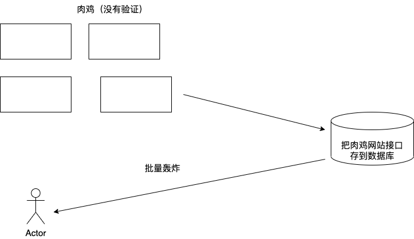
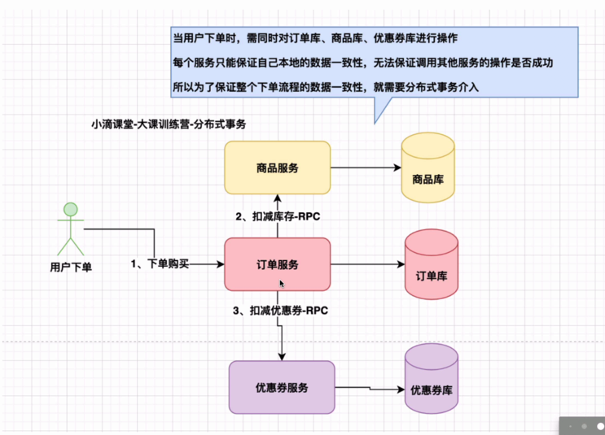
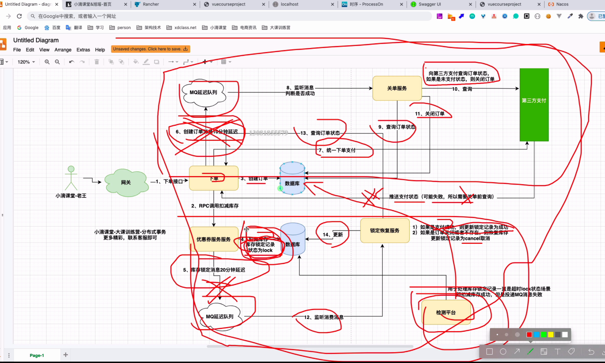

##


### 7 SwaggerUI3.0
* SwaggerUI3.0的使用
    * 进行配置
    * 编写controller
    * 进行测试
    
swagger的配置
```
@Component
@EnableOpenApi
@Data
public class SwaggerConfiguration {
​
​
    @Bean
    public Docket webApiDoc(){
​
​
        return new Docket(DocumentationType.OAS_30)
                .groupName("用户端接口文档")
                .pathMapping("/")
                // 定义是否开启swagger，false为关闭，可以通过变量控制，线上关闭
                .enable(true)
                //配置api文档元信息
                .apiInfo(apiInfo())
                // 选择哪些接口作为swagger的doc发布
                .select()
                .apis(RequestHandlerSelectors.basePackage("net.gaven"))
                //正则匹配请求路径，并分配至当前分组
                .paths(PathSelectors.ant("/api/**"))
                .build();
    }
​
​
​
    private ApiInfo apiInfo() {
        return new ApiInfoBuilder()
                .title("1024电商平台")
                .description("微服务接口文档")
                .contact(new Contact("小滴课堂-二当家小D", "https://xdclass.net", "794666918@qq.com"))
                .version("12")
                .build();
    }
```
编写controller
```
@Api(tags = "收货地址模块")
@RestController
@RequestMapping("/api/v1/address")
public class AddressController {
    @Autowired
    private IAddressService addressService;

    @ApiOperation("根据id查询详情")
    @GetMapping("/find/{address_id}")
    public AddressDO getAddressById(@ApiParam(value = "地址Id", required = true)
                                    @PathVariable("address_id") Integer addressId) {
        AddressDO addressById = addressService.getAddressById(addressId);
        return addressById;
    }

}
```
进行测试
AddressController配置接口文档

访问地址 http://localhost:9001/swagger-ui/index.html#/
* SwaggerUI3.0接口文档分组
  * 具体实现见common包下的config
  * 增加一个Bean 同时修改group组的名称

* SwaggerUI3.0接Header头定义
  * 请求需要自定义http头，比如登录token令牌
  * //新版swagger3.0配置
    .globalRequestParameters(getGlobalRequestParameters())
    .globalResponses(HttpMethod.GET, getGlobalResponseMessage())
    .globalResponses(HttpMethod.POST, getGlobalResponseMessage());
```

import lombok.Data;
import org.springframework.context.annotation.Bean;
import org.springframework.http.HttpMethod;
import org.springframework.stereotype.Component;
import springfox.documentation.builders.*;
import springfox.documentation.oas.annotations.EnableOpenApi;
import springfox.documentation.schema.ScalarType;
import springfox.documentation.service.*;
import springfox.documentation.spi.DocumentationType;
import springfox.documentation.spring.web.plugins.Docket;

import java.util.ArrayList;
import java.util.List;

@Bean
    public Docket webApiDoc(){

        return new Docket(DocumentationType.OAS_30)
                .groupName("用户端接口文档")
                .pathMapping("/")
                // 定义是否开启swagger，false为关闭，可以通过变量控制，线上关闭
                .enable(true)
                //配置api文档元信息
                .apiInfo(apiInfo())
                // 选择哪些接口作为swagger的doc发布
                .select()
                .apis(RequestHandlerSelectors.basePackage("net.xdclass"))
                //正则匹配请求路径，并分配至当前分组
                .paths(PathSelectors.ant("/api/**"))
                //正则匹配请求路径，并分配至当前分组，当前所有接口
                .paths(PathSelectors.any())

                .build()

                //新版swagger3.0配置
                .globalRequestParameters(getGlobalRequestParameters())
                .globalResponses(HttpMethod.GET, getGlobalResponseMessage())
                .globalResponses(HttpMethod.POST, getGlobalResponseMessage());

    }
    
   
   /**
     * 生成全局通用参数, 支持配置多个响应参数
     * @return
     */
    private List<RequestParameter> getGlobalRequestParameters() {
        List<RequestParameter> parameters = new ArrayList<>();
        parameters.add(new RequestParameterBuilder()
                .name("token")
                .description("登录令牌")
                .in(ParameterType.HEADER)
                .query(q -> q.model(m -> m.scalarModel(ScalarType.STRING)))
                .required(false)
                .build());

//        parameters.add(new RequestParameterBuilder()
//                .name("version")
//                .description("版本号")
//                .required(true)
//                .in(ParameterType.HEADER)
//                .query(q -> q.model(m -> m.scalarModel(ScalarType.STRING)))
//                .required(false)
//                .build());
        return parameters;
    }

    /**
     * 生成通用响应信息
     * @return
     */
    private List<Response> getGlobalResponseMessage() {
        List<Response> responseList = new ArrayList<>();
        responseList.add(new ResponseBuilder().code("4xx").description("请求错误，根据code和msg检查").build());
        return responseList;
    }
}

springfox.documentation.service.response
```
##8用户注册
###8.1短信轰炸机


* OCR 识别 



  